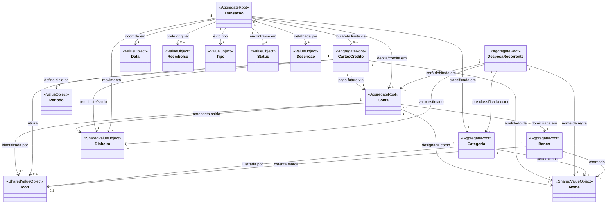

# Estrutura do projeto

Personal finance management web app. Monorepo: Angular 20 SPA (`frontend/`) + Node.js/Express 5
REST API (`backend/`), PostgreSQL via TypeORM. Backend follows DDD/Clean Architecture; frontend
is organized by feature modules. UI text, domain terms, and commit messages are in Portuguese
(PT-PT).

## Layout

```
poupa-me/
├── backend/                          Node.js/Express 5 API (TypeScript, ESM)
│   └── src/
│       ├── domain/<Contexto>/        Entities + ValueObjects per bounded context
│       │   Banco, CartaoCredito, Categoria, Conta, DespesaRecorrente,
│       │   EntradaRecorrente, Shared, Transacao, User
│       ├── repos/<Contexto>/         TypeORM-backed repository implementations + IRepos/
│       ├── services/<Contexto>/      Business logic, orchestrates repos + domain
│       ├── controllers/<Contexto>/   HTTP request handling (Result -> HTTP response)
│       ├── dto/                      API request/response shapes
│       ├── mappers/                  Domain <-> DTO <-> persistence conversions
│       ├── persistence/entities/     TypeORM entities (separate from domain entities)
│       ├── api/routes/               Express routers + Swagger/OpenAPI JSDoc
│       ├── api/middlewares/          isAuth (JWT/session), authorize (RBAC)
│       ├── loaders/                  Bootstrap: express app, TypeORM DataSource, DI, logger, seed
│       ├── core/domain/              AggregateRoot, Entity, ValueObject, UniqueEntityID, DomainEvents
│       ├── core/logic/               Result/Either, Guard, AppError
│       ├── config/index.ts           Env vars (dotenv) + DI registration table
│       └── index.ts                  Process entry point
├── frontend/                         Angular 20 standalone-components SPA, SSR (Angular Universal)
│   └── src/app/
│       ├── features/<feature>/       auth, bancos, cartoes-credito, categorias, contas,
│       │   dashboard, despesas-recorrentes, estatisticas, ia-categorizacao,
│       │   not_authorized, not_found, perfil, transacoes, utilizadores
│       │   └── components/<action>/  criar/ editar/ listar/ per feature
│       ├── layout/                   navbar, header, sidebar, footer, app-layout shell
│       ├── guards/                   RoleGuard, NoLoginGuard
│       ├── services/                 Cross-feature services (menu, notifications, selected-banco)
│       └── shared/components/        Reusable UI, documented in Storybook
├── docs/                             This knowledge base + docs/domain_model.puml
├── docker-compose.yml                Postgres + backend + frontend + Storybook + ngrok tunnel
└── .github/workflows/node.js.yml     CI: npm ci + build only (no test run) on push/PR to main
```

## Tech stack

**Backend** — Node.js (ESM, `"type": "module"`), TypeScript 5.9, Express 5, TypeORM 0.3 +
`pg` (PostgreSQL), `typedi` (manual DI), `reflect-metadata`. Auth: `jsonwebtoken` +
`express-jwt`, `express-session`, `argon2`/`bcryptjs` for password hashing. `agenda` +
`agendash` for scheduled/background jobs (recurring-expense processing). `@huggingface/inference`
for AI-assisted transaction categorization. `swagger-jsdoc` + `swagger-ui-express` for API docs
(`/api-docs`). `celebrate` for request validation. Testing: Jest (ESM mode), `supertest`, `sinon`,
`chai` — coverage is currently minimal.

**Frontend** — Angular 20 (standalone components, no NgModules), Angular SSR, `@angular/cdk`,
`@swimlane/ngx-charts` (statistics charts), `picmo` (emoji picker, used for icon selection),
`dazzle-icons`. Testing: Karma/Jasmine (unit), Cypress (e2e). Storybook 10 for component docs.

**Infra** — Docker Compose (Postgres, backend, frontend, Storybook, ngrok tunnel for mobile
testing), Vercel (production hosting — backend and frontend both needed dedicated fixes to run
there), GitHub Actions CI (build-only, no test gate), Dependabot, release-please for versioning.

## Entry points

- Backend process: `backend/src/index.ts` → `backend/src/loaders/index.ts` wires Express
  (`loaders/express.ts`), the TypeORM DataSource (`loaders/typeorm.ts`), the DI container
  (`loaders/dependencyInjector.ts`), logging (`loaders/logger.ts`), and seed data
  (`loaders/seed.ts`).
- Backend dev: `npm run dev` (tsc-watch + node, hot reload).
- Frontend dev: `npm start` (`ng serve`, proxies `/api` to `localhost:3000` via `proxy.conf.js`).
- Frontend SSR entry: `frontend/src/main.ts` (browser) / `frontend/src/main.server.ts` (server).
- Full stack: `docker compose up` from the repo root.

## Domain model

Source: `docs/domain_model.puml` (rendered: `docs/domain_model.svg`). This diagram documents the
core transactional aggregates; it predates the `User` and `EntradaRecorrente` bounded contexts
that now exist under `backend/src/domain/` — treat those two as undocumented in the diagram
rather than absent from the system.



**Não documentados no diagrama, mas presentes no código**: `User` (autenticação/perfil) e
`EntradaRecorrente` (aparenta ser um agregado irmão de `DespesaRecorrente` para receitas
recorrentes) — ver `backend/src/domain/User/` e `backend/src/domain/EntradaRecorrente/`.
